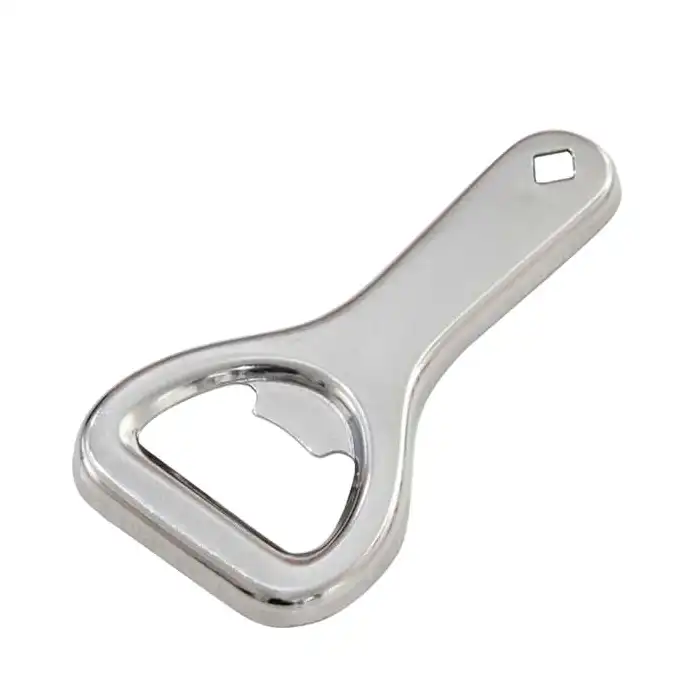

- # Otvírák na pivo
	- ## Koncept
		- **iOpener:** 
			- Slouží k otvírání pivních lahví s rozhraním korunkového uzávěru. Zároveň disponuje ergonomickou rukojetí pro efektivnější a komfortnější úchop.
	- ## Pracovní postup
		1. Uchopíme otvírák dominantní rukou
		2. Druhou rukou uchopíme lahev
		3. Zaklesneme otvírací hlavici mezi korunkový uzávěr a hrdlo lahve pod úhlem 35°
		4. Rukou držíce otvírák uvolníme uzávěr lahve svižným pohybem vzhůru
		5. Uzávěr likvidujeme dle pokynů výrobce a nápoj vychutnáváme
	- ## Katalogový list
		
		
		- Celokovové provedení z japonské damaškové nerezové oceli
		- Povrchová protikorozní úprava z rhodia
		- Univerzální otvor na konvenční korunkový uzávěr s průměrem, 32,1 mm
		- Praktický otvor pro případné zavěšení či uchycení, 5x5 mm
		- Odolnost proti otěru
		- Zaoblené hrany pro bezpečné použití
		- Konstrukce umožňuje 12 345 987 použití
	- ## Tutoriál
		 1. V nejbližším obchodě si koupíme lahev oblíbeného piva.
		 2. Po dostatečném času chlazení lahev uchopíme do ruky.
		 3. Do druhé ruky komfortně uchopíme otvírák iOpener.
		 4. Otvírák ladným pohybem zaklesneme pod korunkový uzávěr naší lahve.
		 5. Jednoduchým pohybem otvíráku vzhůru otevřeme lahev s pivem.
		 6. Po úspěšném otevření si podle nálady nalijeme pivo do sklenice nebo vychutnáváme přímo z lahve.
	- ## Reference
		- [Otvírák - definice](https://cs.wikipedia.org/wiki/Otv%C3%ADrák_lahv%C3%AD)
		- [Korunkový uzávěr - definice](https://cs.wikipedia.org/wiki/Korunkový_uzávěr)
		- [Obrázek](https://www.stephensons.com/metal-crown-bottle-opener.html)
